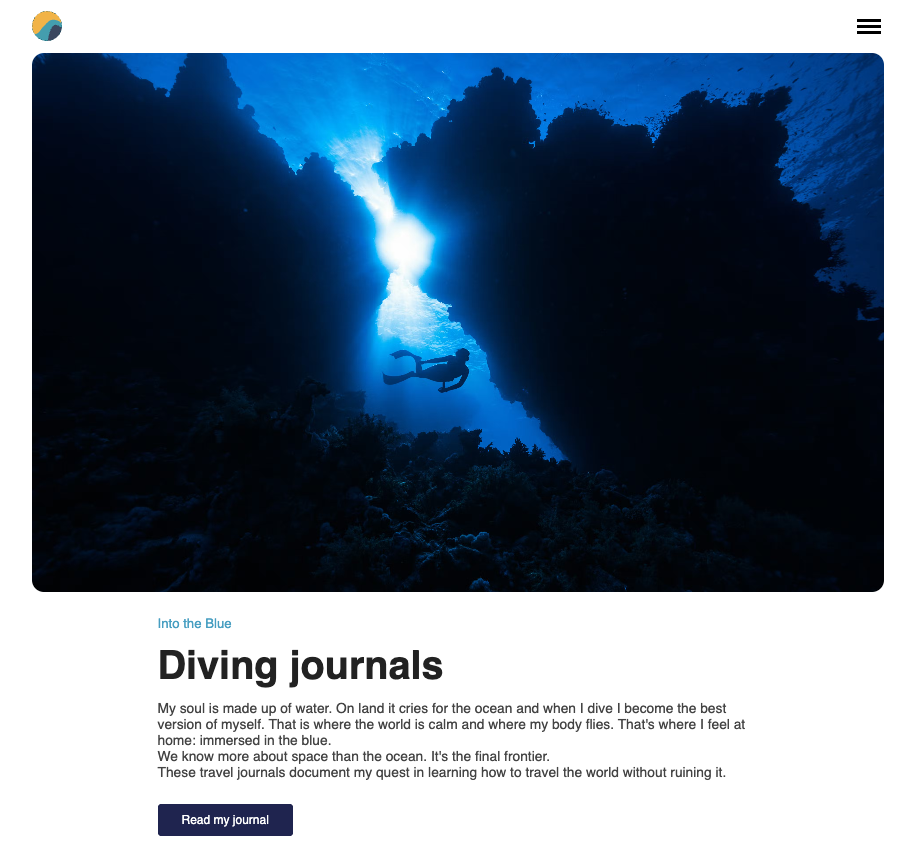

## CMS 
This project is a Next.js App Router site with a headless CMS backend powered by Prismic.
It is structured for clarity, scalability, and ease of content management.

Pages are located in src/app/ and follow the Next.js App Router conventions. 
Each route (homepage, articles, about) is a folder with its own page.tsx and optional CSS module for local styles.
Global layout and fonts are managed in src/app/layout.tsx and src/app/globals.css.
Navigation is handled by a reusable NavBar component (src/app/navBar/NavBar.tsx), which can be included on any page as needed.

Prismic integration is set up in src/lib/prismic.ts, and all content fetching is done via the Prismic client.
Slices and dynamic content blocks are managed with Prismic Slices and rendered using the SliceZone component.

Styling is a mix of global CSS for base styles and CSS modules for page/component-specific styles.

Images and static assets are placed in the public/ directory and referenced with root-relative paths (e.g. /logo.svg).
All images fetched through Prismic library, except for the logo which is my own design. 

This structure allows for:
- Easy addition of new pages and components.
- Clean separation of concerns between layout, content, and presentation.
- Flexible content modeling and editing via Prismic.

For the purpose of this project I created a fictional blogsite for a professional diver. 

 


## Project Structure

- `src/app/`: All Next.js pages (homepage, articles, about)
- `src/lib/prismic.ts`: Prismic client setup

## Development

1. Clone the repo and install dependencies:
   ```bash
   npm install
   ```
2. Set up a `.env.local` with your Prismic repo info:
   ```
   PRISMIC_ACCESS_TOKEN=your-token
   ```
3. Run the dev server:
   ```bash
   npm run dev
   ```

## Adding Articles

1. Go to your Prismic dashboard.
2. Create a new document of type `article`.
3. Fill in the title, summary, body, image, and (optionally) video.
4. Publish the article. It will appear on your site after the next build or revalidation.

## Deployment

Deploy to Vercel or your preferred platform. See [Next.js deployment docs](https://nextjs.org/docs/app/building-your-application/deploying).


-----

This is a [Next.js](https://nextjs.org) project bootstrapped with [`create-next-app`](https://nextjs.org/docs/app/api-reference/cli/create-next-app).

## Getting Started

First, run the development server:

```bash
npm run dev
# or
yarn dev
# or
pnpm dev
# or
bun dev
```

Open [http://localhost:3000](http://localhost:3000) with your browser to see the result.

You can start editing the page by modifying `app/page.tsx`. The page auto-updates as you edit the file.

This project uses [`next/font`](https://nextjs.org/docs/app/building-your-application/optimizing/fonts) to automatically optimize and load [Geist](https://vercel.com/font), a new font family for Vercel.

## Learn More

To learn more about Next.js, take a look at the following resources:

- [Next.js Documentation](https://nextjs.org/docs) - learn about Next.js features and API.
- [Learn Next.js](https://nextjs.org/learn) - an interactive Next.js tutorial.

You can check out [the Next.js GitHub repository](https://github.com/vercel/next.js) - your feedback and contributions are welcome!

## Deploy on Vercel

The easiest way to deploy your Next.js app is to use the [Vercel Platform](https://vercel.com/new?utm_medium=default-template&filter=next.js&utm_source=create-next-app&utm_campaign=create-next-app-readme) from the creators of Next.js.

Check out our [Next.js deployment documentation](https://nextjs.org/docs/app/building-your-application/deploying) for more details.
